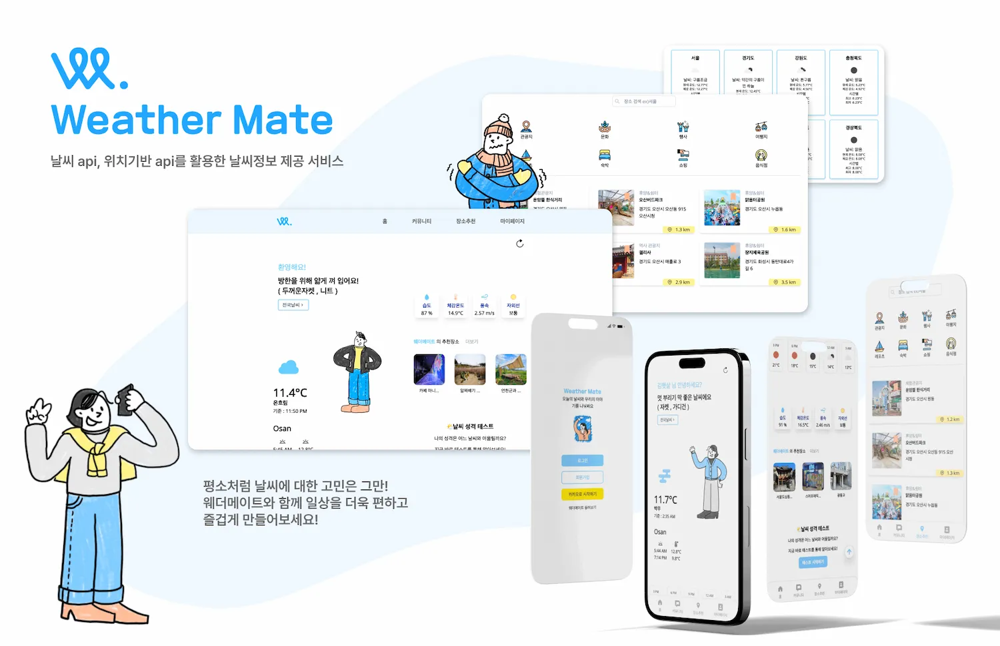

<h1 align="center">웨더메이트(WeatherMate)🌤️</h1>
</br>

<p align="center">


</br>

## 1. 프로젝트 소개

> “현재 위치와 시간에 해당하는 날씨와 알맞은 옷차림을 추천해드립니다!”

- 사용자의 위치 정보에 따른 날씨와 테마별 인근 장소 추천을 도와주는 날씨 친구 서비스

</br>

> ### 배포 페이지 링크

👉🏻 <a target="_blank" href="https://weathermates.netlify.app/" alt="바로가기">WeatherMate</a>

```수정하기
ID: hello@weathermate.com
PW: 11111111
```

</br>

> ### 개발 기간

- #### 2024.03 ~ 2024.04 / 2024.09 ~ 2024.11

  </br>

> ### 사용 기술

<div>
  
  
  
  <!--  -->
  
</br> 
  
  
  
</div>
<div>
  
  
  
  
</div>
<div>
  
  
  
</div>
  </br>

## 2.팀 소개

<table>
  <tbody>
    <tr>
      <td align="center"><a href="https://github.com/woojoung1217"><br /><sub><b>FE 전희선(팀장)</b></sub></a><br /></td>
      <td align="center"><a href="https://github.com/g0meee"><<br /><sub><b>FE 김경미</b></sub></a><br /></td>
      <td align="center"><a href="https://github.com/woojoung1217"><br /><sub><b>FE 윤우중</b></sub></a><br /></td>
      <td align="center"><a href="https://github.com/holajjm"><br /><sub><b>FE 정종민</b></sub></a><br /></td>
     </tr>
  </tbody>
</table>

</br>

## 3. 세부 역할 분담

### 💜 정종민

> **⚙️ 공통 컴포넌트 작성 & 커스텀 훅 생성**

- 공통 컴포넌트 개발
  - `DetailPageHeader` 작성
  - `useCustomAxios` 작성
  - 리드미 작성
    <br />

> **UI 구현**

#### 커뮤니티 메인 화면

- 인기 포스팅 출력 화면
- 게시글 목록 렌더링 화면

#### 게시글 작성 화면

- 게시글 작성 영역
- 날씨 이모티콘 선택 버튼 영역
- 파일 첨부 영역

#### 게시글 상세 조회 화면

- 댓글 리스트 영역 출력 화면
- 상세 댓글

<br/>

> **기능 구현**

#### 커뮤니티 메인 페이지

- 각 게시글의 조회 수가 높은 순서대로 인기 게시물 출력
- 각 게시글의 조회 수 및 날씨 정보, 댓글 수,글 내용, 첨부 사진 출력
- 특정 게시글의 내용 검색 시 검색 기능

#### 커뮤니티 게시글 상세 조회 페이지

- 게시글의 조회 수, 댓글 수, 작성 시간 정보 출력
- 게시글에 작성자 유효성 검사를 통한 삭제 기능 제한적 구현

#### 커뮤니티 게시글 작성 페이지

- 게시글 작성 시 이미지 파일 첨부 기능
- 게시글 작성 시 날씨에 따른 이모티콘 설정 후 날씨 정보 첨부 기능
- 게시글 내용 작성 기능

#### 댓글 작성 기능

- 특정 게시글에 댓글 등록 기능 구현
- 댓글 작성 시 작성자 정보, 작성 시간, 댓글 내용 출력 구현
- 댓글 작성자 유효성 검사를 통해 삭제 기능 제한적 구현

#### 마이페이지 작성 글 조회

- 특정 유저가 본인이 작성한 글 조회 기능 구현


## 4. 프로젝트 폴더 구조

```
📦WeatherMate
 ┣ 📂.vercel
 ┣ 📂dist
 ┣ 📂node_modules
 ┣ 📂public
 ┃ ┣ 📂Clothes
 ┃ ┣ 📂icon
 ┃ ┣ 📂Location
 ┃ ┣ 📂MBTIImage
 ┃ ┣ 📂realImage
 ┃ ┣ 📂WeatherIcon
 ┃ ┣ 📂WeatherInfo
 ┃ ┣ 📜robots.txt
 ┃ ┗ 📜sitemap.xml
 ┣ 📂src
 ┃ ┣ 📂assets
 ┃ ┣ 📂components
 ┃ ┃ ┣ 📂layout
 ┃ ┃ ┃ ┣ 📜Button.tsx
 ┃ ┃ ┃ ┣ 📜DetailPageHeader.tsx
 ┃ ┃ ┃ ┣ 📜Footer.tsx
 ┃ ┃ ┃ ┣ 📜Header.tsx
 ┃ ┃ ┃ ┣ 📜HeaderCategory.tsx
 ┃ ┃ ┃ ┣ 📜Index.tsx
 ┃ ┃ ┃ ┣ 📜Loading.tsx
 ┃ ┃ ┃ ┣ 📜LocatioLoading.tsx
 ┃ ┃ ┃ ┣ 📜NavigationBar.tsx
 ┃ ┃ ┃ ┣ 📜Search.tsx
 ┃ ┃ ┃ ┣ 📜Submit.tsx
 ┃ ┃ ┃ ┗ 📜ToTheTopButton.tsx
 ┃ ┃ ┣ 📂modal
 ┃ ┃ ┃ ┣ 📜CommunityModal.tsx
 ┃ ┃ ┃ ┣ 📜MainModal.tsx
 ┃ ┃ ┣ 📂skeleton
 ┃ ┃ ┃ ┣ 📜CommunityPopularSkeleton.tsx
 ┃ ┃ ┃ ┣ 📜LocationItemSkeleton.tsx
 ┃ ┃ ┃ ┣ 📜MainAllWeatherSkeleton.tsx
 ┃ ┃ ┃ ┣ 📜MainComentSkeleton.tsx
 ┃ ┃ ┃ ┣ 📜MainLocationWeatherSkeleton.tsx
 ┃ ┃ ┃ ┣ 📜MainTimeZoneSkeleton.tsx
 ┃ ┃ ┗ 📜KakaoShareButton.tsx
 ┃ ┣ 📂constants
 ┃ ┃ ┣ 📜Coment.ts
 ┃ ┃ ┣ 📜env.ts
 ┃ ┃ ┣ 📜MbtiQuestionData.ts
 ┃ ┃ ┣ 📜MbtiResultData.ts
 ┃ ┃ ┣ 📜WeatherRealImage.ts
 ┃ ┣ 📂features
 ┃ ┃ ┣ 📂weather
 ┃ ┃ ┣ 📜useWeatherQuery.ts
 ┃ ┃ ┣ 📜useWeatherTimeQuery.ts
 ┃ ┣ 📂hooks
 ┃ ┃ ┣ 📜EnvCheck.ts
 ┃ ┃ ┣ 📜modalPortal.ts
 ┃ ┃ ┣ 📜TimeDiff.ts
 ┃ ┃ ┣ 📜UnixTime.ts
 ┃ ┃ ┣ 📜useCoords.ts
 ┃ ┃ ┣ 📜useCustomAxios.ts
 ┃ ┃ ┣ 📜useDebounce.ts
 ┃ ┃ ┣ 📜usePageTitle.ts
 ┃ ┃ ┗ 📜useScrollTop.ts
 ┃ ┣ 📂pages
 ┃ ┃ ┣ 📂community
 ┃ ┃ ┃ ┣ 📜CommunityDetail.tsx
 ┃ ┃ ┃ ┣ 📜CommunityEdit.tsx
 ┃ ┃ ┃ ┣ 📜CommunityItem.tsx
 ┃ ┃ ┃ ┣ 📜CommunityMain.tsx
 ┃ ┃ ┃ ┣ 📜CommunityNew.tsx
 ┃ ┃ ┃ ┣ 📜CommunityPopularItem.tsx
 ┃ ┃ ┃ ┣ 📜ReplyItem.tsx
 ┃ ┃ ┃ ┣ 📜ReplyMain.tsx
 ┃ ┃ ┃ ┗ 📜ReplyNew.tsx
 ┃ ┃ ┣ 📂location
 ┃ ┃ ┃ ┣ 📜Location.tsx
 ┃ ┃ ┃ ┣ 📜LocationDetailPage.tsx
 ┃ ┃ ┃ ┣ 📜LocationItem.tsx
 ┃ ┃ ┃ ┣ 📜LocationKeyword.tsx
 ┃ ┃ ┃ ┣ 📜LocationMainPage.tsx
 ┃ ┃ ┃ ┣ 📜LocationMap.tsx
 ┃ ┃ ┃ ┣ 📜LocationSearch.tsx
 ┃ ┃ ┃ ┗ 📜noResultMsg.tsx
 ┃ ┃ ┣ 📂main
 ┃ ┃ ┃ ┣ 📜MainAllCitiesWeather.tsx
 ┃ ┃ ┃ ┣ 📜MainHomePage.tsx
 ┃ ┃ ┃ ┣ 📜MainMyLocationWeather.tsx
 ┃ ┃ ┃ ┣ 📜MainNowWeather.tsx
 ┃ ┃ ┃ ┣ 📜MainWeatherDetail.tsx
 ┃ ┃ ┃ ┗ 📜MainWeatherTimeZone.tsx
 ┃ ┃ ┣ 📂Mbti
 ┃ ┃ ┃ ┣ 📜MbtiHome.tsx
 ┃ ┃ ┃ ┣ 📜MbtiQuestion.tsx
 ┃ ┃ ┃ ┗ 📜MbtiResult.tsx
 ┃ ┃ ┣ 📂user
 ┃ ┃ ┃ ┣ 📜UserBoard.tsx
 ┃ ┃ ┃ ┣ 📜UserBookmark.tsx
 ┃ ┃ ┃ ┣ 📜UserEdit.tsx
 ┃ ┃ ┃ ┣ 📜UserLogin.tsx
 ┃ ┃ ┃ ┣ 📜UserOauth.tsx
 ┃ ┃ ┃ ┣ 📜UserPage.tsx
 ┃ ┃ ┃ ┣ 📜UserSignUp.tsx
 ┃ ┃ ┃ ┗ 📜UserValidLogin.tsx
 ┃ ┃ ┗ 📜ErrorPage.tsx
 ┃ ┣ 📂recoil
 ┃ ┃ ┗ 📜atom.ts
 ┃ ┣ 📂store
 ┃ ┃ ┗ 📜store.ts
 ┃ ┣ 📂types
 ┃ ┃ ┃ 📜CommunityType.ts
 ┃ ┃ ┃ 📜LocationType.ts
 ┃ ┃ ┃ 📜MbtiType.ts
 ┃ ┃ ┃ 📜UserType.ts
 ┃ ┃ ┗ 📜WeatherType.ts
 ┃ ┣ 📜App.css
 ┃ ┣ 📜App.tsx
 ┃ ┣ 📜env.d.ts
 ┃ ┣ 📜global.d.ts
 ┃ ┣ 📜index.css
 ┃ ┣ 📜index.d.ts
 ┃ ┣ 📜main.tsx
 ┃ ┗ 📜routes.tsx
 ┣ 📜.env
 ┣ 📜.eslintrc.cjs
 ┣ 📜.gitignore
 ┣ 📜.prettierrc.cjs
 ┣ 📜index.html
 ┣ 📜package-lock.json
 ┣ 📜package.json
 ┣ 📜postcss.config.ts
 ┣ 📜README.md
 ┣ 📜tailwind.config.ts
 ┣ 📜tsconfig.json
 ┣ 📜vercel.json
 ┗ 📜vite.config.ts
```

## 5. UI 미리보기
<!-- 
|                        시작 화면                         |                        메인 화면                         |                  메인 화면 - 전국 날씨                   |
| :------------------------------------------------------: | :------------------------------------------------------: | :------------------------------------------------------: |
|  |  |  |

|                메인 화면 - 추천 장소 상세                |               메인 화면 - 날씨 성격 테스트               |                       로그인 화면                        |
| :------------------------------------------------------: | :------------------------------------------------------: | :------------------------------------------------------: |
|  |  |  |

|                   커뮤니티 - 메인화면                    |                커뮤니티 - 게시글 상세보기                |                  장소 추천 - 메인 화면                   |
| :------------------------------------------------------: | :------------------------------------------------------: | :------------------------------------------------------: |
|  |  |  |

|                        마이페이지                        |            카테고리 - 상세 내용            |            카테고리 - 상세 내용            |
| :------------------------------------------------------: | :----------------------------------------: | :----------------------------------------: |
|  |  |  | -->
